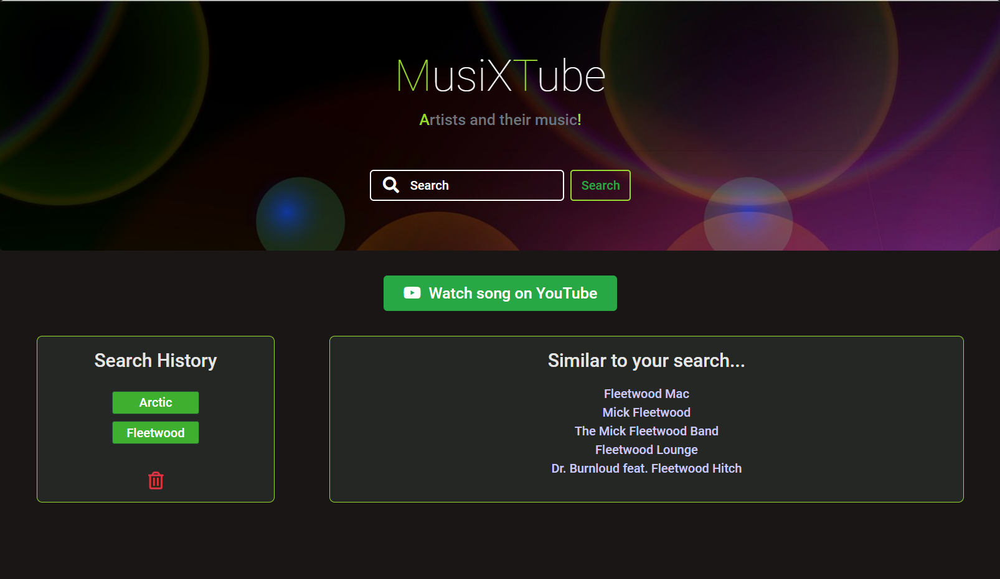

# Music Search App

## Description

---

A web app that allows users to search for a song, artist or band and see a dynamically generated link to a relevant YouTube video to said song/musician. We also display 5 similarly named artists in the 'Similar to your search' section.

This is accomplished with the use of 2 APIs (Youtube and Musixmatch ) to query the input from the user input.

We used Bootstrap to build the functionality, as well as HTML and CSS to give the app our own style. We used JavaScript and JQuery to make get requests from the API and dynamically generate elements as required.

The user's search results are stored to localStorage and presented as persistent buttons on the page in the 'search history' section. There is a delete button to remove these items from localStorage.

---

## Screenshots

---

## Technologies used

##   

We also used Bootstrap to create a basic structure and two APIs to get data - YouTube Data API to present a dynamic link to the user and the Musixmatch API to present similar artists.

## Link
Live application: https://zaitken1.github.io/music-app/

## License

MIT Licence
